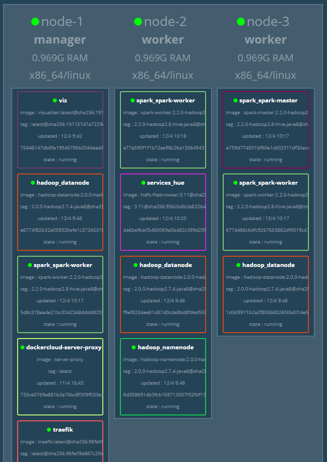
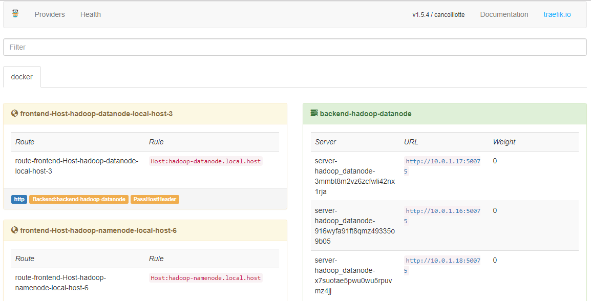
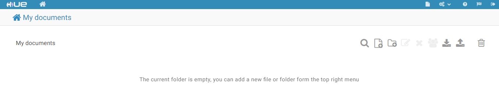

## !This repository is fork of [big-data-europe project](https://github.com/big-data-europe/docker-hadoop-spark-workbench)

First we need to create docker swarm cluster, in our case we using Digital Ocean cloud computing platform 
Tutorial based on [digitalocean community tutorial](https://www.digitalocean.com/community/tutorials/how-to-create-a-cluster-of-docker-containers-with-docker-swarm-and-digitalocean-on-ubuntu-16-04)

In this tutorial, you'll learn how to deploy a cluster of Docker machines using the Swarm feature of Docker 1.12 on DigitalOcean.
Each Docker node in the cluster will be running Ubuntu 16.04. While you can run a cluster made up of dozens, hundreds, or thousands of Docker hosts,
the cluster we'll be setting up in this tutorial will be made up of a manager node and two worker nodes, for a total of three cluster members.
Once you complete this tutorial, you'll be able to add more nodes to your cluster with ease.

Prerequisites
For this tutorial, you'll need:
A local machine with Docker installed.
A DigitalOcean API token for creating droplets for cluster.
Docker Machine installed on your local computer, which you'll use to create three hosts.

# Step 1 — Provisioning the Cluster Nodes
We need to create several Docker hosts for our cluster. As a refresher, the following command provisions a single Dockerized host, where $DOTOKEN is an environment variable that evaluates to your DigitalOcean API token (Add that before creating droplets to your environments):
```
docker-machine create --driver digitalocean --digitalocean-image ubuntu-16-04-x64 --digitalocean-access-token $DOTOKEN machine-name
```
Imagine having to do that to set up a cluster made up of at least three nodes, provisioning one host at a time.
We can automate the process of provisioning any number of Docker hosts using this command, combined with some simple Bash scripting. Execute this command on your local machine to create three Docker hosts, named node-1, node-2, and node-3:

```
$ for i in 1 2 3; do docker-machine create --driver digitalocean \
$ --digitalocean-image ubuntu-16-04-x64 --digitalocean-region ams3 \
$ --digitalocean-access-token $DOTOKEN node-$i; done
```
Key --digitalocean-region optional and default = nyc3
Key --digitalocean-size optional and default = s-1vcpu-1gb
For correct work zeppelin one of the node must have 2gb ram (--digitalocean-size s-1vcpu-2gb)
After the command has completed successfully, you can verify that all the machines have been created by visiting your DigitalOcean dashboard, or by typing the following command:
```
docker-machine ls
```
The output should be similar to the following, and it should serve as a quick reference for looking up the IP address of the nodes:
```
Output
NAME     ACTIVE   DRIVER         STATE     URL                          SWARM   DOCKER    ERRORS
node-1   -        digitalocean   Running   tcp://111.111.111.111:2376             v1.12.2   
node-2   -        digitalocean   Running   tcp://111.111.111.112:2376           v1.12.2   
node-3   -        digitalocean   Running   tcp://111.111.222.222:2376         v1.12.2
```
At this point, all three Dockerized hosts have been created, and you have each host's IP address. They are also all running Docker 1.12.x, but are not yet part of a Docker cluster. In the next steps, we'll configure the firewall rules that will make the nodes to function as members of a cluster, pick one of the nodes and make it the Docker Swarm manager, and configure the rest as Docker Swarm workers.
# Step 2 — Configuring Firewall Rules to Allow Docker Swarm Traffic
A cluster has to have at least one node that serves as a manager, though for a production setup, three managers are recommended. For this setup, let's pick the first node and make it the Swarm manager. The other two nodes will be the worker nodes.
Certain network ports must be opened on the nodes that will be be part of a cluster for the cluster to function properly.
TCP port 2376 for secure Docker client communication. This port is required for Docker Machine to work. Docker Machine is used to orchestrate Docker hosts.
TCP port 2377. This port is used for communication between the nodes of a Docker Swarm or cluster. It only needs to be opened on manager nodes.
TCP and UDP port 7946 for communication among nodes (container network discovery).
UDP port 4789 for overlay network traffic (container ingress networking).

In this article, you'll learn how to configure the Linux firewall on Ubuntu 16.04 using the different firewall management applications available on all Linux distributions. Those firewall management applications are FirewallD, IPTables Tools, and UFW, the Uncomplicated Firewall. UFW is the default firewall application on Ubuntu distributions, including Ubuntu 16.04. While this tutorial covers three methods, each one delivers the same outcome, so you can choose the one you are most familiar with.
f you just set up your Docker hosts, UFW is already installed. You just need to enable and configure it. Follow this guide to learn more about using UFW on Ubuntu 16.04.

Execute the following commands on the nodes that will function as Swarm managers:
```
ufw allow 22/tcp
ufw allow 2376/tcp
ufw allow 2377/tcp
ufw allow 7946/tcp
ufw allow 7946/udp
ufw allow 4789/udp
ufw enable
ufw reload
systemctl restart docker
```

Then on each node that will function as a worker, execute the following commands:
```
ufw allow 22/tcp
ufw allow 2376/tcp
ufw allow 7946/tcp 
ufw allow 7946/udp 
ufw allow 4789/udp 
ufw enable
ufw reload
systemctl restart docker
```

After you've completed this step, you can initialize the cluster manager.

# Step 3 — Initializing The Cluster Manager
We've decided that node-1 will be our cluster manager, so log in to the node from your local machine:
```
docker-machine ssh node-1
docker swarm init --advertise-addr node_ip_address
```
You'll see output that looks like the following:
```
Output
Swarm initialized: current node (a35hhzdzf4g95w0op85tqlow1) is now a manager.

To add a worker to this swarm, run the following command:

    docker swarm join \
    --token SWMTKN-1-3k7ighcfs9352hmdfzh31t297fd8tdskg6x6oi8kpzzszznffx-6kovxm3akca2qe3uaxtu07fj3 \
    111.111.111.111:2377

To add a manager to this swarm, run 'docker swarm join-token manager' and follow the instructions.
```
So now you have a Docker Swarm with a manager configured. Let's add the remaining nodes as workers.

# Step 4 — Adding Nodes to the Cluster
To complete this step, you might want to open another terminal and leave the terminal tab or window you used to log into the Swarm manager alone for now.

First, connect to node-2 from your local machine:
```
docker-machine ssh node-2
```
And then:
```
docker swarm join \
--token your_swarm_token \
manager_node_ip_address:2377
```
After the command has been executed successfully, you'll see this response:
```
Output
This node joined a swarm as a worker.
```
Log out of node-2, and then repeat this process with node-3 to add it to your cluster.
You have now added two worker nodes to the cluster. If the firewall rules were configured correctly, you now have a functioning Docker Swarm, with all the nodes synchronized.

To register your swarm at cloud.docker.com we need to run proxy container on the manager node
```
docker run -ti --rm -v /var/run/docker.sock:/var/run/docker.sock dockercloud/registration
```
Then type name of the swarm cluster into your namespace in format <username>/<clustername>
After successful execution command above we can connect to our swarm from docker client from local machine.

On next step after creating swarm cluster we will install demo container that displays Docker
services running on a Docker Swarm in a diagram. Example:



If port 8080 is already in use on your host (as in our case), you can specify e.g. -p [YOURPORT]:8080 instead. Example public port 8888:
```
docker service create --name=viz --publish=8888:8080 --constraint=node.role==manager --mount=type=bind,src=/var/run/docker.sock,dst=/var/run/docker.sock dockersamples/visualizer
```
On manager node clone repo:
```
git clone https://github.com/big-data-europe/docker-hadoop-spark-workbench.git
cd docker-hadoop-spark-workbench
```

# Running Hadoop and Spark in Swarm cluster

## Initial setup

Make some preparations. Check docker-compose version:
```
docker-compose -v
```
and upgrade docker-compose to 1.20.0 version if needed. To upgrade we need:

Verify where old docker-compose located:
```
which docker-compose
```

Delete old binary:
```
sudo rm <path_from_previous_step>
```

Download newest version of docker-compose:
```
curl -L https://github.com/docker/compose/releases/download/1.20.0/docker-compose-`uname -s`-`uname -m` -o /usr/bin/docker-compose
```

Set necessary rights to executable file:
```
chmod +x /usr/bin/docker-compose
```
Install make utility if needed
```
apt install make
```

Create an overlay network:
```
make network
```

Deploy traefik:
```
make traefik
```

Now navigate to <yourserver_ip>:8080 and check that traefik is running and <yourserver_ip>:8888 for viz service

## Deploying HDFS (without YARN)

There is no need to explicitly pull the images, however doing it this way you can see the download progress.
In case of multiple server deployment, if you pull only on your swarm manager, the images still need to be pulled on other nodes.
Pull the images:
```
docker-compose -f docker-compose-hadoop.yml pull
```

To deploy HDFS run:
```
make hadoop
```

Go to traefik again and check if hadoop is running, copy/paste generated domain name into browser and check if namenode/datanode is working as well.

## Deploying Spark

Pull the images:
```
docker-compose -f docker-compose-spark.yml pull
```

Deploy Spark:
```
make spark
```

## Deploying Apache Zeppelin and HDFS Filebrowser

Pull the images:
```
docker-compose -f docker-compose-services.yml pull
```

Deploy the services:
```
make services
```

Navigate to traefik and go to HDFS Filebrowser/Apache Zeppelin from there.

Træfik is a modern HTTP reverse proxy and load balancer that makes deploying microservices easy. Træfik integrates with your existing infrastructure components (Docker, Swarm mode, Kubernetes, Marathon, Consul, Etcd, Rancher, Amazon ECS, ...) and configures itself automatically and dynamically. Telling Træfik where your orchestrator is could be the only configuration step you need to do.


Traefik uses HTTP header 'Host' for routing requests to frontends(see traefik landing page)



After configure DNS you can access services on docker swarm via browser, for example you can config hosts file (Windows) like there:
```
<swarm_node_ip>   hadoop-namenode.local.host
<swarm_node_ip>   hadoop-datanode.local.host
<swarm_node_ip>   services-hue.local.host
<swarm_node_ip>   services-zeppelin.local.host
<swarm_node_ip>   spark-spark-master.local.host
<swarm_node_ip>   spark-spark-worker.local.host
```
and open links in browser

While accessing HUE utility we will faced with known issue https://github.com/big-data-europe/docker-hadoop-spark-workbench/issues/9 and after login we need type http://<services-hue.local.host>/home and:




